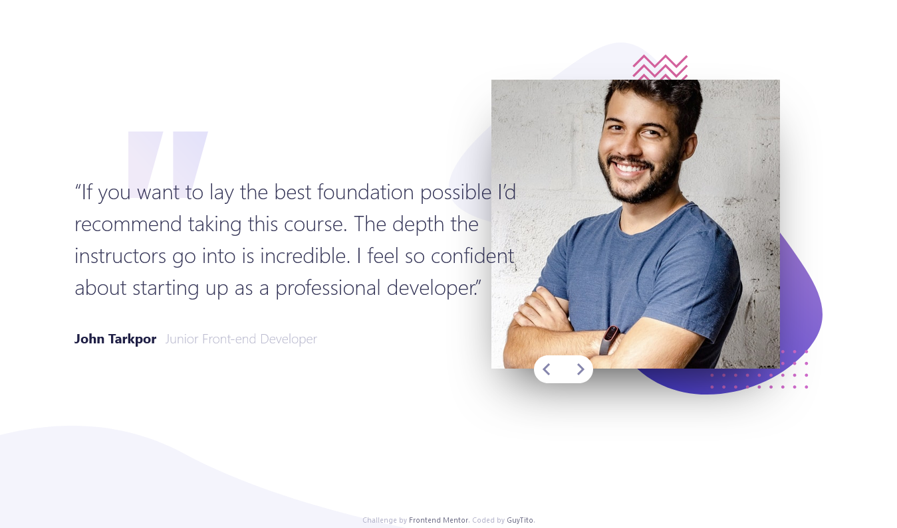

# Frontend Mentor - Coding bootcamp testimonials slider solution

This is a solution to the [Coding bootcamp testimonials slider challenge on Frontend Mentor](https://www.frontendmentor.io/challenges/coding-bootcamp-testimonials-slider-4FNyLA8JL). Frontend Mentor challenges help you improve your coding skills by building realistic projects. 

## Table of contents

- [Overview](#overview)
  - [The challenge](#the-challenge)
  - [Screenshot](#screenshot)
  - [Links](#links)
- [My process](#my-process)
  - [Built with](#built-with)
- [Author](#author)

## Overview

### The challenge

Users should be able to:

- View the optimal layout for the component depending on their device's screen size
- Navigate the slider using either their mouse/trackpad or keyboard

### Screenshot

Screenshot

### Links

- Solution URL: [Add solution URL here](https://www.frontendmentor.io/solutions/responsive-testimony-slider-using-javascript-and-animejs-Bm03kYJSB)
- Live Site URL: [Add live site URL here](https://bootcamp-fm.netlify.app/)

## My process

### Built with

- Semantic HTML5 markup
- Mobile-first workflow
- Tailwindcss
- Javascript
- Anime.js

## Author

- Frontend Mentor - [@guytito](https://www.frontendmentor.io/profile/guytito)
- Twitter - [@i_jollof](https://www.twitter.com/i_jollof)